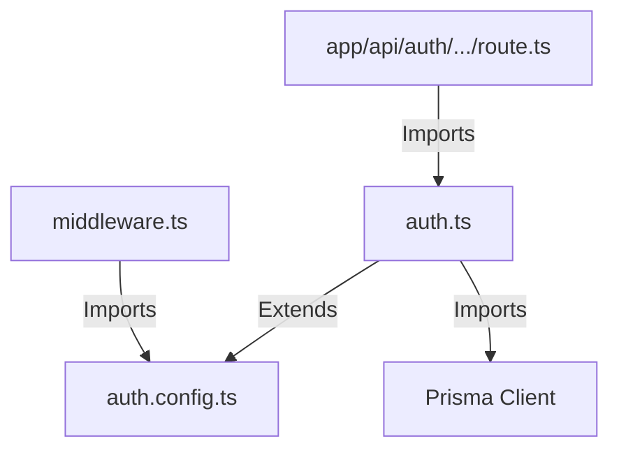

# Technical Research: Phase 2 (Authentication & Custom Password Hashing)

## 1. Django Legacy Hashing Verification
Django uses a modular hashing system. Password hashes in `accounts_user.password` follow this pattern:
`<algorithm>$<iterations>$<salt>$<hash>`

### PBKDF2 SHA256 Verification
- **Prefix**: `pbkdf2_sha256`
- **Verification Code**:
  ```typescript
  import crypto from "crypto";

  export function verifyPBKDF2(password: string, storedHash: string): boolean {
    const parts = storedHash.split("$");
    if (parts.length !== 4 || parts[0] !== "pbkdf2_sha256") return false;

    const iterations = parseInt(parts[1], 10);
    const salt = parts[2];
    const hashHex = parts[3];

    // Compute key using the salt and iterations
    const key = crypto.pbkdf2Sync(password, salt, iterations, 32, "sha256");
    const computedHash = key.toString("base64");

    // Timing-safe comparison to prevent side-channel attacks
    return crypto.timingSafeEqual(
      Buffer.from(hashHex, "base64"),
      Buffer.from(computedHash, "base64")
    );
  }
  ```

### MD5 Verification
- **Prefix**: `md5`
- **Format**: `md5$<salt>$<hash>` (Django legacy MD5)
- **Verification Code**:
  ```typescript
  export function verifyMD5(password: string, storedHash: string): boolean {
    const parts = storedHash.split("$");
    if (parts.length !== 3 || parts[0] !== "md5") return false;

    const salt = parts[1];
    const hashHex = parts[2];

    const hasher = crypto.createHash("md5");
    hasher.update(salt + password);
    const computedHash = hasher.digest("hex");

    return crypto.timingSafeEqual(
      Buffer.from(hashHex, "hex"),
      Buffer.from(computedHash, "hex")
    );
  }
  ```

---

## 2. NextAuth v5 Edge-Split Architecture
Next.js 15 Middleware runs in the Edge Runtime. The full Prisma engine and direct TCP connections are unsupported in the Edge. We must split the auth configuration to separate the routing checks (Edge-safe) from the database operations (Node.js runtime).

### File Structure Map


### auth.config.ts (Edge-Compatible)
- Contains ONLY the basic config: pages redirects and the `authorized` callback.
- No Prisma client or cryptographic module imports.
- OAuth Providers (Google, GitHub) config can sit here, but database adapter calls must be deferred to `auth.ts`.
- Defines route rules:
  ```typescript
  import type { NextAuthConfig } from "next-auth";

  export const authConfig = {
    pages: {
      signIn: "/login",
    },
    callbacks: {
      authorized({ auth, request: { nextUrl } }) {
        const isLoggedIn = !!auth?.user;
        const isOnDashboard = nextUrl.pathname.startsWith("/participant") ||
                              nextUrl.pathname.startsWith("/organizer") ||
                              nextUrl.pathname.startsWith("/admin");
        
        if (isOnDashboard) {
          if (isLoggedIn) return true;
          return false; // Redirect to /login
        }
        return true;
      },
    },
    providers: [], // Configured without DB references
  } satisfies NextAuthConfig;
  ```

### auth.ts (Full Node.js Runtime)
- Imports `authConfig` from `auth.config.ts`.
- Appends the Prisma Adapter, the Credentials Provider (database lookup, verifyPassword check), and custom callbacks (JWT/Session).
- Imports the full Prisma client and runs the authentication logic.

---

## 3. Session and JWT Type Extensions
To use `session.user.role` and `session.user.profileId` in TypeScript without type assertions, we extend the NextAuth interfaces:

```typescript
// types/next-auth.d.ts
import { DefaultSession } from "next-auth";

declare module "next-auth" {
  interface Session {
    user: {
      id: string;
      role: string;
      profileId: string | null;
    } & DefaultSession["user"];
  }

  interface User {
    role?: string | null;
    profileId?: string | null;
  }
}

declare module "next-auth/jwt" {
  interface JWT {
    role?: string | null;
    profileId?: string | null;
  }
}
```

---

## 4. OAuth Profile Integration Flow
When a user authenticates via Google or GitHub:
1. Auth.js verifies the identity token.
2. The user record is created in `accounts_user`.
3. In the `signIn` callback in `auth.ts`, check if the user has an associated role and profile:
   ```typescript
   async signIn({ user, account, profile }) {
     if (account?.provider === "google" || account?.provider === "github") {
       // Query user from Prisma to verify role and profile exist
       const dbUser = await prisma.accounts_user.findUnique({
         where: { email: user.email! },
         include: { participant_participantprofile: true }
       });
       
       if (dbUser && !dbUser.role) {
         // Perform atomic update:
         // 1. Set role to 'participant' in accounts_user
         // 2. Insert into participant_participantprofile
         await prisma.$transaction([
           prisma.accounts_user.update({
             where: { id: dbUser.id },
             data: { role: "participant" }
           }),
           prisma.participant_participantprofile.create({
             data: {
               user_id: dbUser.id,
               college: "",
               semester: 1,
               degree: "",
               visibility: true,
               created_at: new Date(),
               updated_at: new Date()
             }
           })
         ]);
       }
     }
     return true;
   }
   ```
This ensures zero "orphan users" in the system after social logins.
